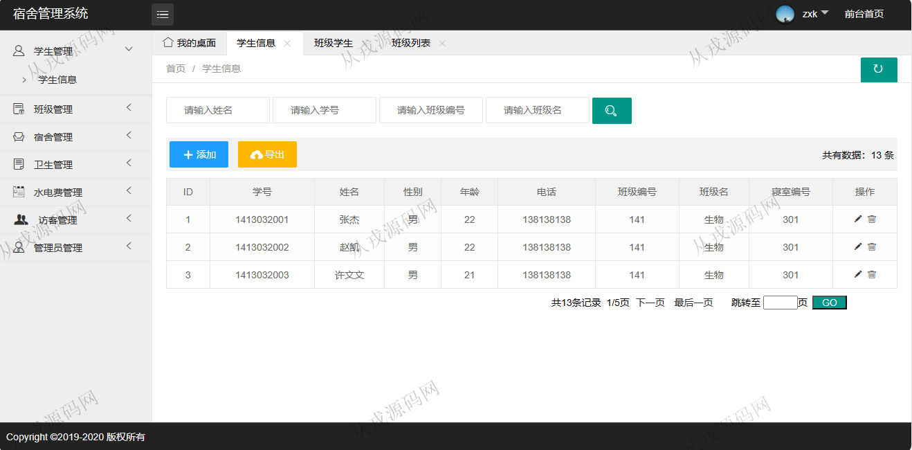
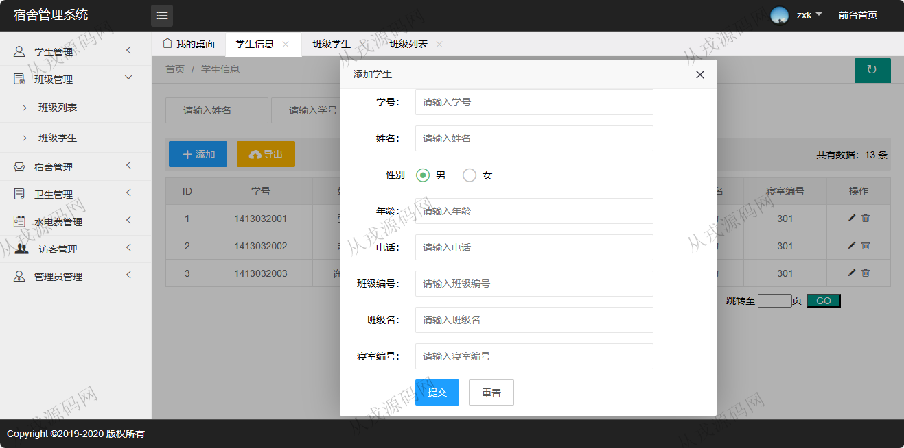
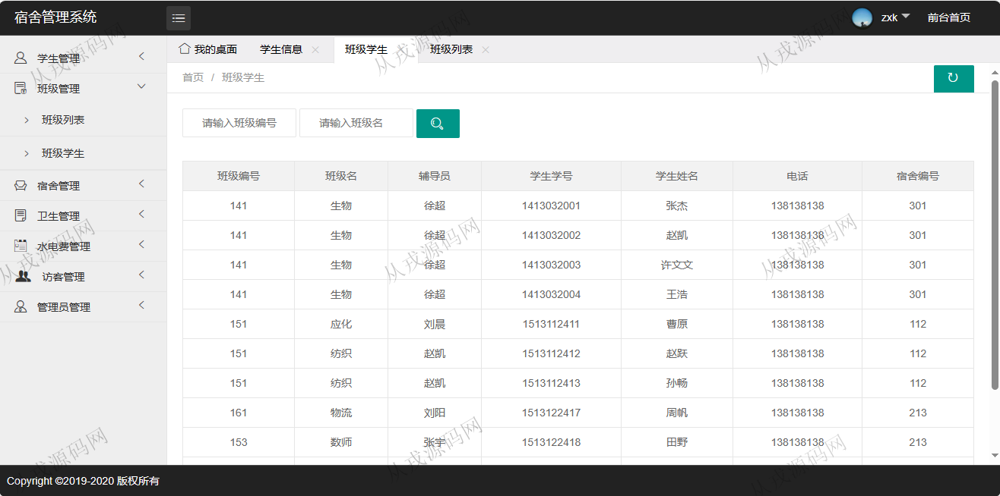
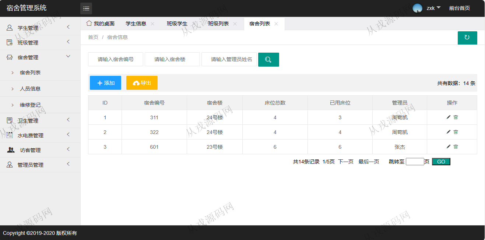
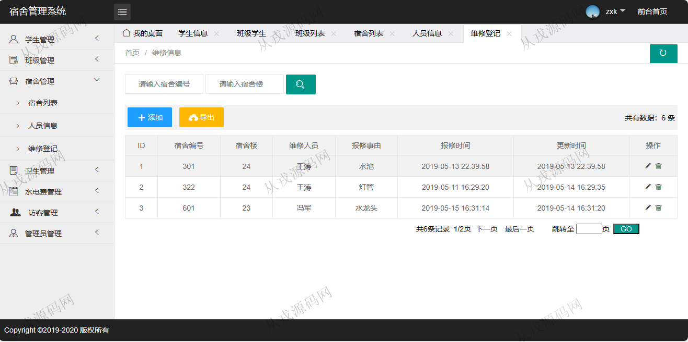
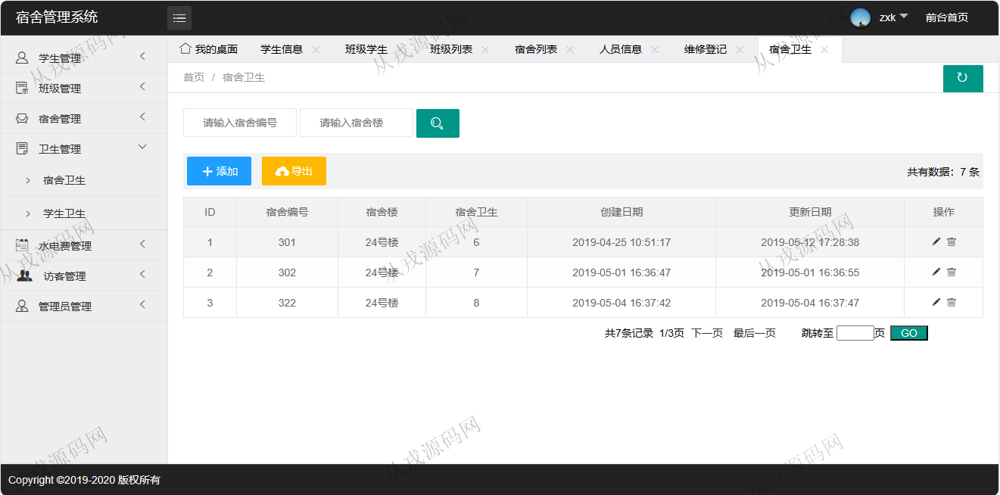
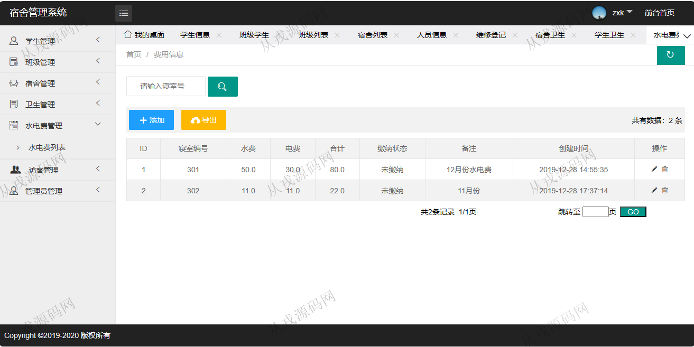
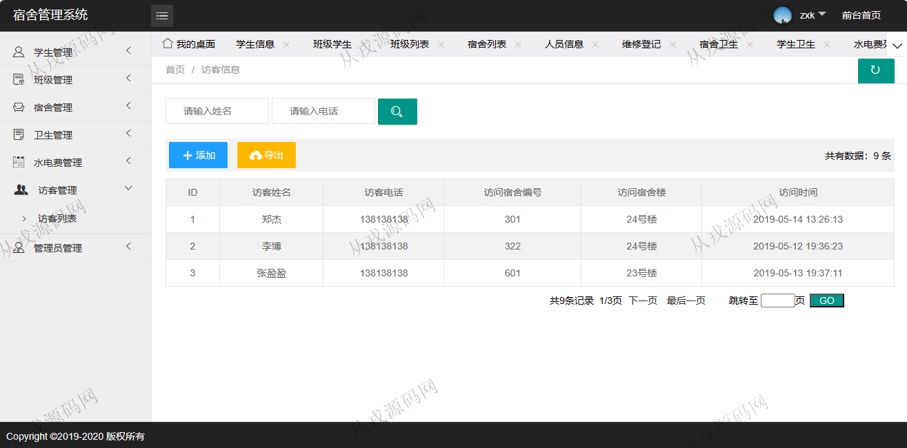
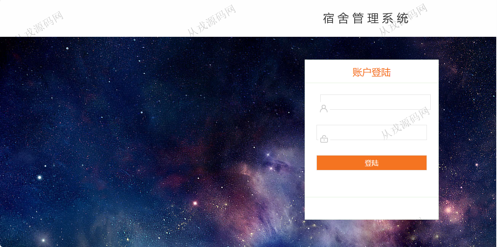

<h1 align="center">131.宿舍管理系统</h1>

- <b>完整代码获取地址：从戎源码网 ([https://armycodes.com/](https://armycodes.com/))</b>
- <b>技术探讨、资料分享，请加QQ群：692619798</b> 
- <b>作者微信：19941326836  QQ：952045282</b> 
- <b>承接计算机毕业设计、Java毕业设计、Python毕业设计、深度学习、机器学习</b>
- <b>选题+开题报告+任务书+程序定制+安装调试+论文+答辩ppt 一条龙服务</b>
- <b>所有选题地址 ([https://github.com/YuLin-Coder/AllProjectCatalog](https://github.com/YuLin-Coder/AllProjectCatalog)) </b>

## 项目介绍
基于ssm的宿舍管理系统：前端 jsp、jquery、layui，后端 springmvc、spring、mybatis；集成学生管理、班级管理、宿舍管理、卫生管理功能于一体的系统。

## 功能介绍

- 学生管理：学生信息的增删改查，多条件查询，姓名模糊查询
- 班级管理：班级信息的增删改查，班级学生列表查询
- 宿舍管理：宿舍信息的增删改查，宿舍人员信息查询，宿舍维修信息的增删改查
- 卫生管理：宿舍卫生信息的增删改查，学生卫生信息的增删改查
- 水电费管理：水电费信息的增删改查，数据导出
- 访客管理：访客信息的增删改查，数据导出
- 管理员管理：管理员账户信息的增删改查，包括密码修改功能

## 环境

- <b>IntelliJ IDEA 2021.3</b>

- <b>Mysql 5.7.26</b>

- <b>Tomcat 7.0.73</b>

- <b>JDK 1.8</b>

## 运行截图

